# BLE Fitness Tracker with PIC32CX SG61 Curiosity Ultra Evaluation Board
<h2 align="center"> <a href="https://github.com/Microchip-MPLAB-Harmony/reference_apps/releases/latest/download/pic32cx_sg61_fitness_tracker.zip" > Download </a> </h2>

-----
## Description:
> The application demonstrates a solution based on Microchip products for the health care industry
  and wearable products. The application displays heart rate readings on a display and posts this Heart Rate data to Microchip Bluetooth Data (MBD)
  android mobile application via BLE (Bluetooth Low Energy).

> The Mikro Elektronika Heart Rate 9 click board is used to read the heart pulse.
  Mikroelektronika OLED C Click display is used for displaying the heart rate.
  RNBD451PE Add On Board using the RNBD451 Bluetooth module is used to send the heart rate data over BLE.

> The Heart Rate 9 click introduces Microchip's proprietary method of measuring multiple
  signals in a body using pseudorandom binary sequence generation and phase division multiplexing
  This algorithm for processing data from the sensor and it can send data for 3 different diodes
  (green, ir, red) who give out a diagram of the heartbeat and its frequency per minute.

> The host MCU PIC32CX SG61 is interfaced with the Heart Rate 9 click over the USART interface, the RNBD451PE Bluetooth module over UART and the OLED C click over SPI Interface.

## Modules/Technology Used:

- Peripheral Modules
	- SysTick
	- EIC
	- SERCOM (SPI)
	- SERCOM (USART)
	- EVSYS
- RNBD Driver
- STDIO Library

## Hardware Used:

- [PIC32CX SG61 Curiosity Ultra Evaluation Board - EV09H35A](https://www.microchip.com/en-us/development-tool/EV09H35A)
- [mikroBUS adapter ATMBUSADAPTER-XPRO](https://www.microchip.com/ATMBUSADAPTER-XPRO)
- [RNBD451 Add On Board - EV25F14A](https://www.microchip.com/en-us/development-tool/EV25F14A)
- [MikroElektronika Heart Rate 9 click](https://www.mikroe.com/heart-rate-9-click)
- [MikroElektronika OLED C click](https://www.mikroe.com/oled-c-click)

## Software/Tools Used:
 This project has been verified to work with the following versions of software tools:

Refer [Project Manifest](./firmware/src/config/pic32cx_sg61_cult/harmony-manifest-success.yml) present in harmony-manifest-success.yml under the project folder *firmware/src/config/pic32cx_sg61_cult*
- Refer the [Release Notes](../../../release_notes.md#development-tools) to know the **MPLAB X IDE** and **MCC** Plugin version. Alternatively, [Click Here](https://github.com/Microchip-MPLAB-Harmony/reference_apps/blob/master/release_notes.md#development-tools).
- Install [Microchip Bluetooth Data Android App](https://play.google.com/store/apps/details?id=com.microchip.bluetooth.data&hl=en_IN&gl=US) in your Android mobile **or**
- Install [Microchip Bluetooth Data iOS App](https://apps.apple.com/in/app/microchip-bluetooth-data/id1319166097) in your iOS mobile

 Because Microchip regularly update tools, occasionally issue(s) could be discovered while using the newer versions of the tools. If the project doesn’t seem to work and version incompatibility is suspected, It is recommended to double-check and use the same versions that the project was tested with.  To download original version of MPLAB Harmony v3 packages, refer to document [How to Use the MPLAB Harmony v3 Project Manifest Feature](https://ww1.microchip.com/downloads/en/DeviceDoc/How-to-Use-the-MPLAB-Harmony-v3-Project-Manifest-Feature-DS90003305.pdf)

## Setup:
- Mount the **Heart Rate 9 click board** on the **mikro bus** connector of PIC32CX SG61 Curiosity Ultra Evaluation Board 
- Mount the **OLED C click** on one **mikroBUS adapter** and then connect the adapter to **EXT 1** extension header
- Mount the **RNBD451PE Add On Board** on one **mikroBUS adapter** and then connect the adapter to **EXT 2** extension header
- Power the PIC32CX SG61 Curiosity Ultra Evaluation Board from a Host PC through a Type-A male to Micro-B USB cable connected to Micro-B port (J300) labeled DEBUG USB

  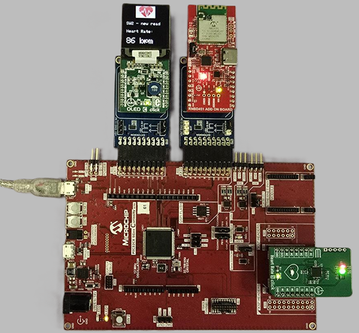

## Programming hex file:
The prebuilt hex file can be programmed by following the below steps.

### Steps to program the hex file
- Open MPLAB X IDE
- Close all existing projects in IDE, if any project is opened.
- Go to File -> Import -> Hex/ELF File
- In the "Import Image File" window, Step 1 - Create Prebuilt Project, Click the "Browse" button to select the prebuilt hex file, 
	located into the hex folder in the dowloaded zip file (pic32cx_sg61_fitness_tracker/hex/pic32cx_sg61_cult.X.production.hex).
- Select Device has "PIC32CX1025SG61128"
- Ensure the proper tool is selected under "Hardware Tool"
- Click on Next button
- In the "Import Image File" window, Step 2 - Select Project Name and Folder, select appropriate project name and folder
- Click on Finish button
- In MPLAB X IDE, click on "Make and Program Device" Button. The device gets programmed in sometime
- Follow the steps in "Running the Demo" section below

## Programming/Debugging Application Project:
- Open the project (pic32cx_sg61_fitness_tracker/firmware/pic32cx_sg61_cult.X) in MPLAB X IDE
- Ensure "PIC32CX SG61 Curiosity Ultra" is selected as hardware tool to program/debug the application
- Build the code and program the device by clicking on the "Make and Program Device" button in MPLAB X IDE tool bar
- Follow the steps in "Running the Demo" section below

## Running the Demo:
 *Before proceeding, install the Microchip Bluetooth Data app on a Smartphone.* 
- Enable Bluetooth and location from Smartphone settings
- Perform reset by unplugging and re-plugging the power cable of PIC32CX SG61 Curiosity Ultra Evaluation Board
- Open the "**Microchip Bluetooth Data (MBD)**" app on your smartphone

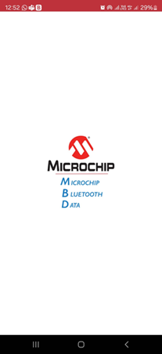

- Tap on "Bluetooth Smart" icon on the dashboard. If prompted, allow the application to turn on Bluetooth.

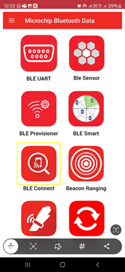

- After power-up, the application displays the Microchip logo on the OLED C click board and initializes the bluetooth module if necessary, and the heart rate sensor.
- The two LEDs (LED1 and LED2) on the PIC32CX SG61 Curiosity Ultra Evaluation Board will toggle untill initialization finishes
- After successful initialization of the heart rate sensor, two integrated LEDs on the Heart Rate 9 click lights up.
- On the OLEC C display a message is shown that the application is initializing
- After the application initializes, a message to put the finger on the sensor and press the SW2 swith is shown
- **LED0** on the PIC32CX SG61 Curiosity Ultra Evaluation Board will shitch **OFF**
- **LED1** on the PIC32CX SG61 Curiosity Ultra Evaluation Board will shitch **ON**

- Now, scan for Bluetooth devices by tapping START SCAN option on the MBD APP.
- The RNBD451PE device should appear as **MCHP_PIC32CX_SG16_HR** in the list of Bluetooth devices.

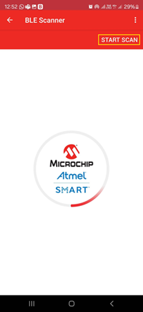

- Stop the scan and connect the **MCHP BLE device** by clicking on **MCHP_PIC32CX_SG16_HR**.
	This will establish a connection between the MBD BLE application and the RNBD451PE BLE device.

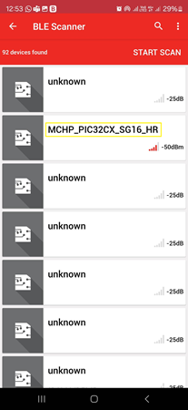

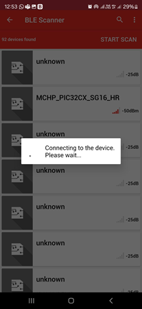

- Once BLE device is connected, the application shows the different services screen. Scrolll down and tap on the **Heart Rate Service**, it will redirect to **Sensor Location** screen.

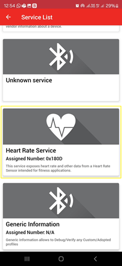

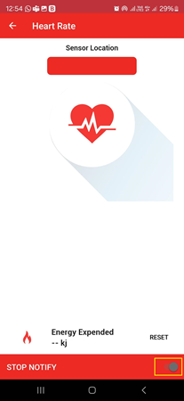

- In the bottom right corner of the **Sensor Location** screen, disable and enable the **Notify Button**.

- Place and keep your finger on Pulse Detection Indicator on the heart rate 9 click sensor as shown in the figure below.
- Observe the red LED in the middle of the heart lits shortly at short intervals of time. This would be the indication the sensor is corectly reading the pulse.

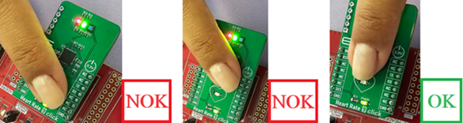

- Press on SW2 to read the sensor.
- **LED0** on the PIC32CX SG61 Curiosity Ultra Evaluation Board will shitch **ON**
- **LED1** on the PIC32CX SG61 Curiosity Ultra Evaluation Board will shitch **OFF**
- Wait till the **LED0** on PIC32CX SG61 Curiosity Ultra Evaluation Board goes **OFF** and **LED1** goes **ON**. 
- The user can more reads by clicking SW2 without removing the finger from the sensor.
  **Note**: Make sure smartphone screens are not turned off and don't switch to any other App(s) on your smartphone.
- The heart rate value (in bpm - beats per minute) should be displayed on the **Sensor Location** screen as shown in the image below. 

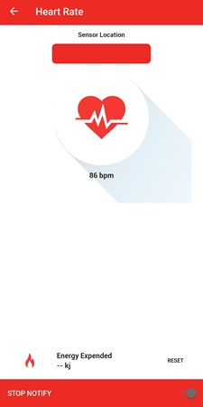

- Also, the same heart rate value should be displayed on the OLED C display.

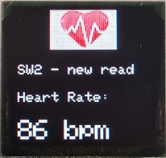

### Running the Demo without BLE:
#### Note: To test the demo without BLE, disconnect the RNBD from EXT 2 connector of the PIC32CX SG61 Curiosity Ultra Evaluation Board.
- Follow the same steps mentioned above, into the "Running the Demo" section, skipping the steps that are mentioning the Phone Bluetooth Application.

## Comments:
- Place your index finger gently on the heart rate 9 click sensor, don't push or put pressure on the sensor (the heart rate values may not be accurate)
- Make sure the smartphone screen is not turned off when reading Heart Rate Sensor data using the MBD smartphone APP and also, don't switch to any other smartphone App(s)
- Reference Technical Briefs
	1. [Creating the First Application on PIC32CX SG Microcontrollers Using MPLAB Harmony v3 with MPLAB Code Configurator (MCC)](https://ww1.microchip.com/downloads/aemDocuments/documents/MCU32/ProductDocuments/SupportingCollateral/Creating-the-First-Application-on-PIC32CX-SG-Microcontrollers-Using-MPLAB-Harmony-v3-with-MPLAB-Code-Configurator-DS90003345.pdf)
	2. [Immutable Boot on PIC32CX SG41 MCU](https://ww1.microchip.com/downloads/aemDocuments/documents/MCU32/ProductDocuments/SupportingCollateral/Immutable-Boot-on-PIC32CX-SG41-MCU-DS90003359.pdf)
- Video references
	1. [32-bit MCU Digest | Build Smarter with PIC32CX SG using Harmony & MCC: IoT, Automotive & Industrial](https://youtu.be/Vc9jHFuqQOk)
- This application demo builds and works out of box by following the instructions above in "Running the Demo" section. If you need to enhance/customize this application demo, you need to use the MPLAB Harmony v3 Software framework. Refer links below to setup and build your applications using MPLAB Harmony.
	- [How to Setup MPLAB Harmony v3 Software Development Framework](https://ww1.microchip.com/downloads/aemDocuments/documents/MCU32/ProductDocuments/SupportingCollateral/How-to-Setup-MPLAB-Harmony-v3-Software-Development-Framework-DS90003232.pdf)	
	- [Video - How to Set up the Tools Required to Get Started with MPLAB® Harmony v3 and MCC](https://www.youtube.com/watch?v=0rNFSlsVwVw)	
	- [Create a new MPLAB Harmony v3 project using MCC](https://developerhelp.microchip.com/xwiki/bin/view/software-tools/harmony/getting-started-training-module-using-mcc/)
	- [Update and Configure an Existing MHC-based MPLAB Harmony v3 Project to MCC-based Project](https://developerhelp.microchip.com/xwiki/bin/view/software-tools/harmony/update-and-configure-existing-mhc-proj-to-mcc-proj/)
	- [How to Build an Application by Adding a New PLIB, Driver, or Middleware to an Existing MPLAB Harmony v3 Project](https://ww1.microchip.com/downloads/aemDocuments/documents/MCU32/ProductDocuments/SupportingCollateral/How-to-Build-an-Application-by-Adding-a-New-PLIB-Driver-or-Middleware-to-an-Existing-MPLAB-Harmony-v3-Project-DS90003253.pdf)	

Revision:
- v1.7.0 - Released demo application
